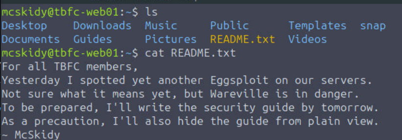
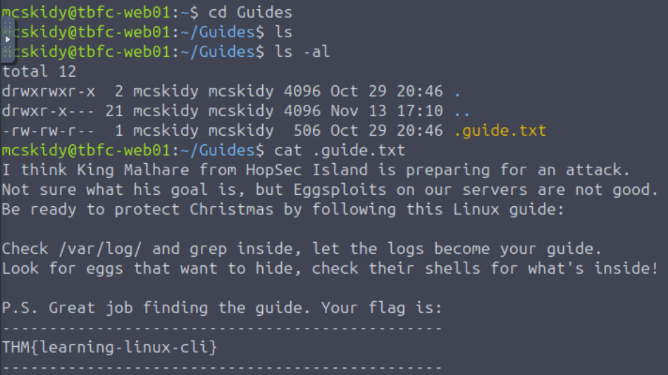
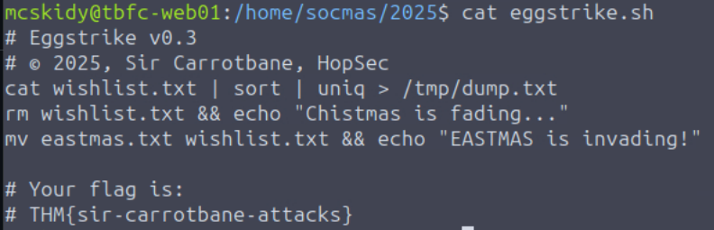
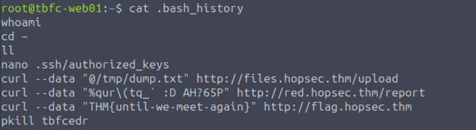

# Linux CLI - Shells Bells

## Objective

- Learn the basics of the Linux command-line interface (CLI)
- Explore its use for personal objectives and IT administration
- Apply your knowledge to unveil the Christmas mysteries

## Environment / Tools
### OS / VM
- Virtual Machine

### Tools and Commands
- ls
- cat
- cd
- grep
- find
- rm
- sort
- uniq
- mv
- sudo su
- whoami
- exit
- ip addr
- uptime

## Process
I started the Virtual Machine to connect to the lab environment. The goal of this task was to investigate a server breach by analyzing the logs using linux commands. 
I used the ls command to list the contents of the current directory. I then used the cat command `cat README.txt` to view the contents of a file called README.txt. 

Using the cd command I navigated to the Guides directory `cd Guides`. To view the contents of the Guides directory, I used ls but got no output.
So I used `ls -al` to list all files including hidden files in the directory in a long format.
That revealed the hidden guide.txt file.  

Upon reading the contents of the file using cat command, it disclosed a clue to check the logs by navigating to /var/log directory by using the `cd /var/log` command.

After that I used grep command to search for the phrase "Failed password" in the auth.log file using the following command:
`grep "Failed password" auth.log

This showed a lot of failed logins on the socmas account. With the help of McSkidy's guide, I used the find command in the /home/socmas directory with the -name parameter.
`find /home/socmas -name *egg*` 

This revealed a shell script file called eggstrike.sh. Using `cat eggstrike.sh` I viewed the contents of the file. On analyzing the code, I understood that the script basically steals the Christmas wishes and replaces them with a fake file. That is, it replaces the wishlist.txt file with eastmas.txt file and renames this file as wishlist.txt. 

This showed that the server was breached and the Christmas wishlist file has been replaced by the eastmas file. 
By visiting `http://<ip_connection>:8080`

After that to check the usernames and hashed passwords of users, I used the `cat /etc/shadow` but it returned a permission denied error. So I used `sudo su` command to switch to the root user and used the `whoami` command to verify the current user. 

Every command we run is saved in a hidden history file called the Bash History file which is located at the home directory of every user. So I first changed directory to /root then used `cat .bash_history`.

## Answers
Which CLI command would you use to list a directory? 
`ls`

`THM{learning-linux-cli}`

Which command helped you filter the logs for failed logins? 
`grep`

`THM{sir-carrotbane-attacks}`

Which command would you run to switch to the root user?
`sudo su`

Finally, what flag did Sir Carrotbane leave in the root bash history? 
`THM{until-we-meet-again}`

## Result

- Identified evidence of a brute-force login attempt in auth.log

- Discovered a malicious script (eggstrike.sh) in the socmas user directory

- Confirmed the wishlist file was replaced as part of the attack

- Retrieved all required flags from logs and command history

## Notes

- Hidden files require ls -a or ls -al to be visible

- Log analysis is essential for identifying failed login attempts

- Elevated privileges are required to access sensitive system files such as /etc/shadow

- Bash command history can reveal attacker activity

## Takeaways

- Linux CLI tools are powerful for investigation and incident response

- Log files often provide the first indicators of compromise

- Understanding file permissions and privilege escalation is critical

- Small scripts can cause significant impact if executed by attackers
