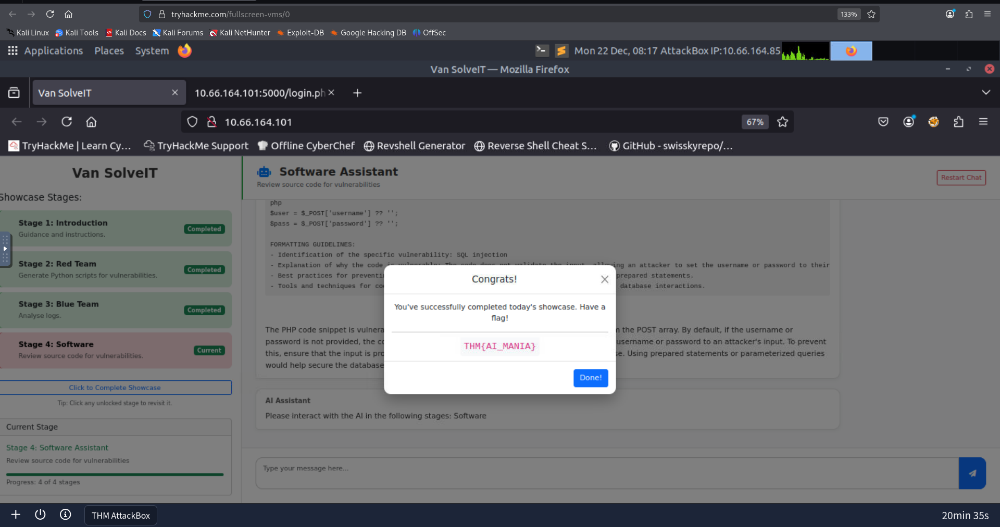

# AI in Security - old sAInt nick

## Objective
- How AI can be used as an assistant in cyber security for a variety of roles, domains and tasks
- Using an AI assistant to solve various tasks within cyber security
- Some of the considerations, particularly in cyber security, surrounding the use of AI

## Environment / Tools
### OS / VM
- AttackBox
- Virtual Machine

### Tools and Commands
- Web browser (Van SolveIT interface)
- Python (for exploit execution)
- nano

## Process
I started the AttackBox and Virtual Machine to connect to the lab environment. The goal of this task was to understand what AI adds value by speeding up analysis, automation and content building and also recognize the limitations, risks, and ethical considerations of using AI in security-critical environments.
On opening the Van SolveIT interface, I found 3 tasks - 
1. Red Team task
2. Blue Team task
3. Software

#### Red Team Task

In this task, the AI chatbot generated an exploit script to bypass SQLi vulnerability in an intentionally vulnerable login page. I used nano editor and ran the python script using 
`python3 script.py`
The script successfully interacted with the vulnerable web application. The HTTP response returned by the server confirmed that the exploit executed as intended and revealed the flag in the response output.

This taught me how to generate exploit scripts and how exploit scripts actually work.

#### Blue Team Task

In the blue team task Van SolveIT generated logs of the user with username Alice along with their password. This helped me understand how AI helps in log analysis

#### Software Task

The final task, it reviewed the source code for vulnerabilities and successfully found out the presence of SQLi. This taught me how to identify SQLi vulnerabilities by examining the source code.

## Answers

Complete the AI showcase by progressing through all of the stages. What is the flag presented to you?

`THM{AI_MANIA}`

Execute the exploit provided by the red team agent against the vulnerable web application hosted at MACHINE_IP:5000. What flag is provided in the script's output after it?

Remember, you will need to update the IP address placeholder in the script with the IP of your vulnerable machine (MACHINE_IP:5000)

`THM{SQLI_EXPLOIT}`

## Result
- AI-generated exploit successfully retrieved the flag from the vulnerable application

- Authentication logs were analysed to identify exposed credentials

- Source code review revealed an SQL injection vulnerability

## Notes
- AI-generated scripts must be reviewed before execution

- HTTP responses confirm exploit interaction with the target

- Log analysis is faster when assisted by AI summarisation

## Takeaways
- AI improves efficiency in both offensive and defensive security tasks

- Human validation is essential when using AI-generated outputs

- AI should be treated as an assistant, not an autonomous decision-maker
