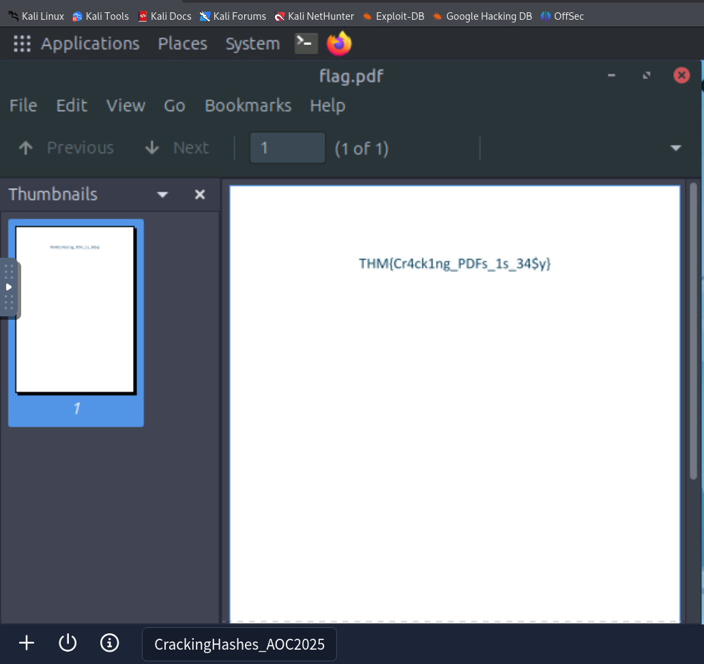
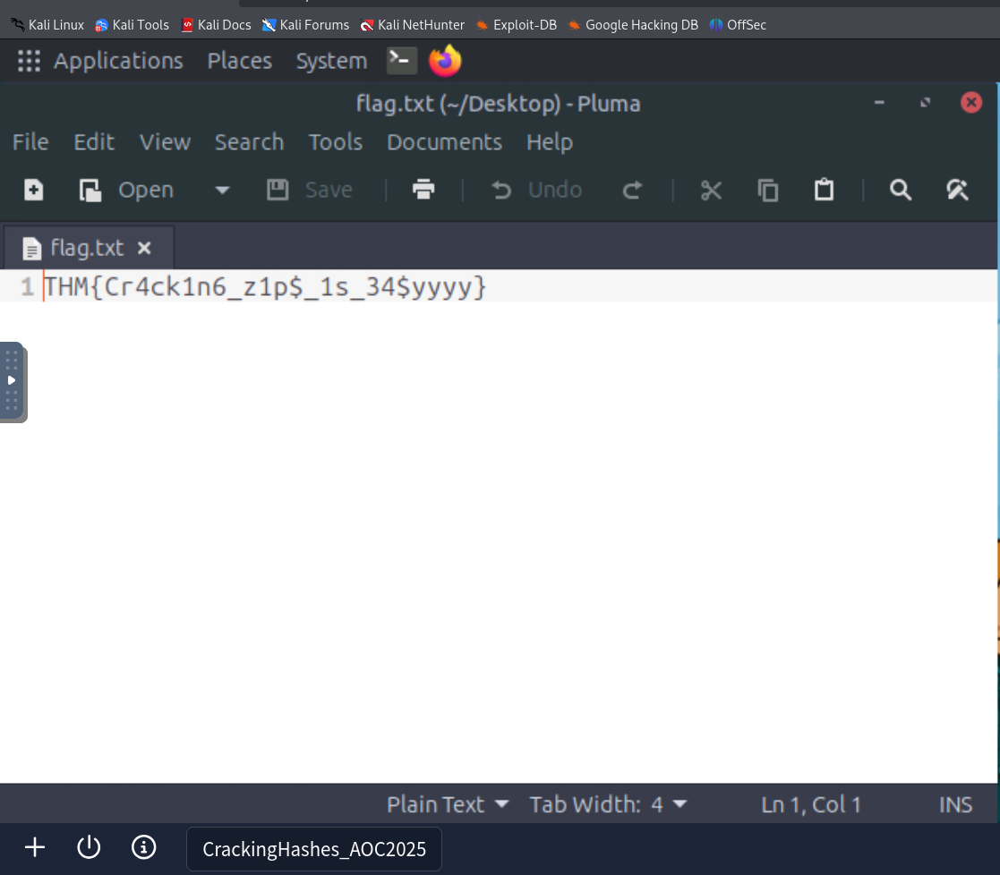

## Passwords - A Cracking Christmas

## Objective

- How password-based encryption protects files such as PDFs and ZIP archives.
- Why weak passwords make encrypted files vulnerable.
- How attackers use dictionary and brute-force attacks to recover passwords.
- A hands-on exercise: cracking the password of an encrypted file to reveal its contents.
- The importance of using strong, complex passwords to defend against these attacks.

## Environment / Tools
### OS / VM
- Virtual Machine

### Tools and Commands
- john the ripper
- pdfcrack
- zip2john
- pdf2john
- rockyou.txt

## Process
I started the Virtual Machine to connect to the lab environment. The goal of this task was to crack the password of an encrypted pdf file and zip file.
For this I used pdfcrack and john the ripper tools on rockyou.txt wordlist.

#### Password cracking of pdf file using pdfcrack

`pdfcrack -f flag.pdf -w /usr/share/wordlists/rockyou.txt`

Additionally I also tried cracking the password of the pdf file using john the ripper

#### Password cracking of pdf file using john the ripper

`pdf2john flag.pdf > pdfhash.txt`

`john --wordlist=/usr/share/wordlists/rockyou.txt pdfhash.txt`

I also learnt that once the password is cracked using john it is stored in the pot file and will not be cracked again in future runs. To view the cracked password, use

`john --show pdfhash.txt`

This behavior is independent of the terminal session.

#### Password cracking of zip file using john the ripper

`zip2john flag.zip > hash.txt`

`john --wordlist=/usr/share/wordlists/rockyou.txt hash.txt`

## Answers

What is the flag inside the encrypted PDF?

`THM{Cr4ck1ng_PDFs_1s_34$y}`

What is the flag inside the encrypted zip file?

`THM{Cr4ck1n6_z1p$_1s_34$yyyy}`

## What was new?

- Different types of password attacks (Brute Force attacks, Dictionary attacks) and the difference between the two.

- Tools to crack passwords: ohn, hashcat, fcrackzip, pdfcrack, zip2john, pdf2john.pl, 7z, qpdf, unzip, 7za, perl invoking pdf2john.pl.

- Gained knowledge about pot files and their uses.

- About Sysmon Event ID 1 in Windows systems and its purpose

- About `nvidia-smi` and the importance of using GPUs while cracking tough passwords

- About `audit ctl` in Linux systems

- Response Playbook

A playbook to follow when such incidents occur. The immediate actions to take are:

    -- Isolate the host if malicious activity is detected. If it is a lab, tag and suppress.

    -- Capture triage artefacts such as process list, process memory dump, nvidia-smi sample output, open files, and the encrypted file.

    -- Preserve the working directory, wordlists, hash files, and shell history.

    -- Review which files were decrypted. Search for follow‑on access, lateral movement or exfiltration.

    -- Identify the origin and intent of the activity. Was this authorised? If not, escalate to the IR team.

    -- Remediate the activity, rotate affected keys and passwords, and enforce MFA for accounts.

    -- Close with education and correct placement of tools into approved sandboxes.

## Result
- Succesfully cracked the password of a pdf file and a zip file

## Notes

- John the Ripper stores cracked passwords in a pot file, meaning hashes are not cracked again in future runs; `john --show <hashfile>` is used to retrieve previously cracked passwords.

- PDF and ZIP encryption relies entirely on password strength. Weak passwords can be recovered quickly using dictionary-based attacks with common wordlists like `rockyou.txt`

- Different tools serve different roles: `pdf2john` and `zip2john` extract hashes, while John performs the cracking using wordlists or brute-force techniques.

## Takeaways

- Weak passwords make encrypted files like PDFs and ZIPs easy to crack.

- Password cracking follows a clear process from hash extraction to cracking and result storage.

- Using strong passwords and proper security controls is essential to prevent such attacks.