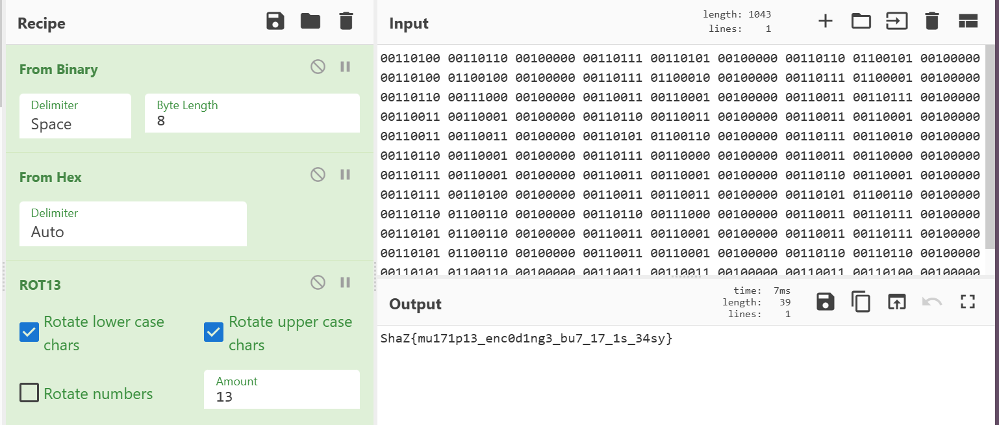

# So Strong Ahhhh? (150 points)

## Description:

The cipher text is protected multiple times go ahead and get the final plain text.

Download the cipher.txt from the attachment.

## Solution:

First used Base 64 decode. And then obtained an Ascii 85 encoded string, decoded it and further got a binary string. Now iI got a hex encoded string. Decoded that and followed it with ROT 13.

The flag is: 
`ShaZ{mu171p13_enc0d1ng3_bu7_17_1s_34sy}`