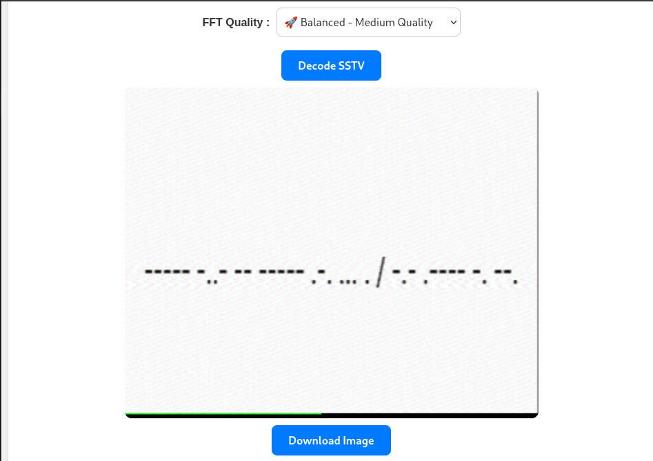
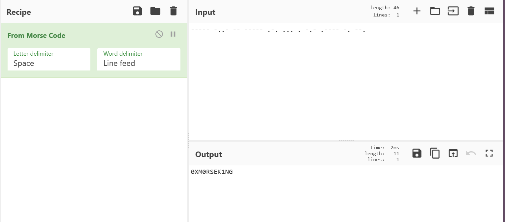
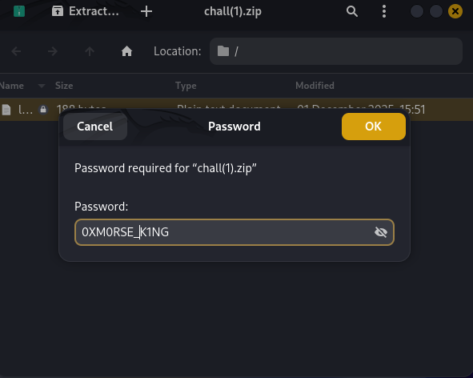
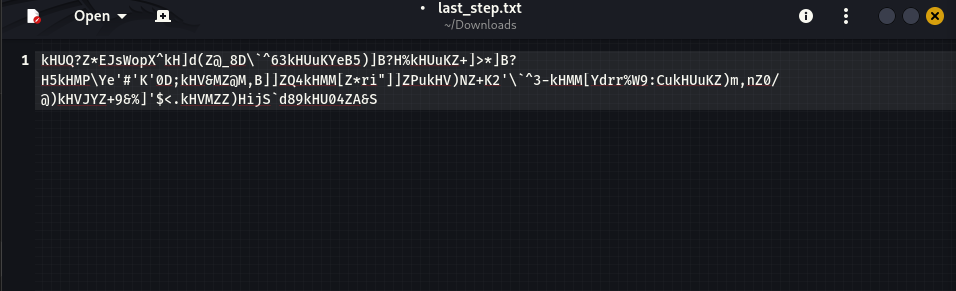
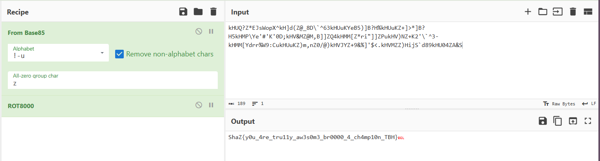

# Epic One (500 points)

## Description:

Two cursed files carry hidden secrets, unlocking one awakens the most forbidden truth buried within the other.

Zip file Password Format: XXXXXXX_XXXX

Flag Format: ShaZ{}

## Solution:

Used SSTV decoder to decode the audio which yielded a morse code. 

Decoding the morse code gave the password of the zip file. 

By unlocking the zip file with this password, I got a text document called last_step.txt which contained a base 85 encoded text. 

After decoding it with base 85 and performed ROT 8000, got the flag.

The flag is: 
`ShaZ{y0u_4re_tru11y_aw3s0m3_br0000_4_ch4mp10n_TBH}`