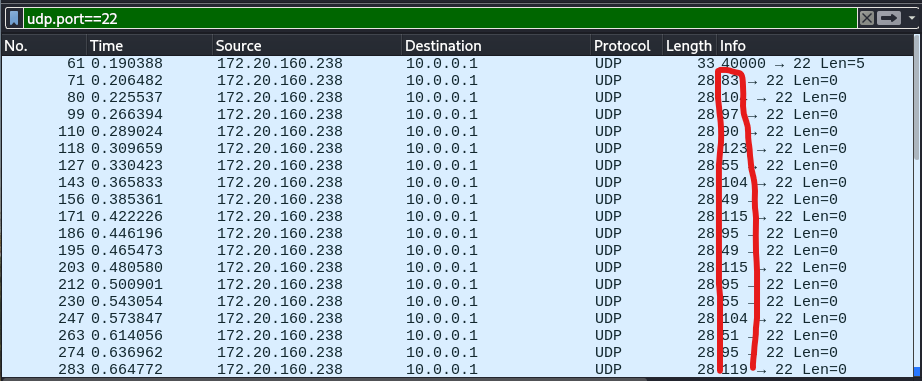

# baby shark (250 points)

## Description:

Amid the noise, a few packets whisper the truth. Find the ones that shouldn’t be alive.

## Solution:

Filtered the traffic by UDP and converted all numbers given in the Info field's beginning from decimal using CyberChef

The flag obtained was
`ShaZ{7h1s_1s_7h3_w1r3_sh4rk_f14g}`