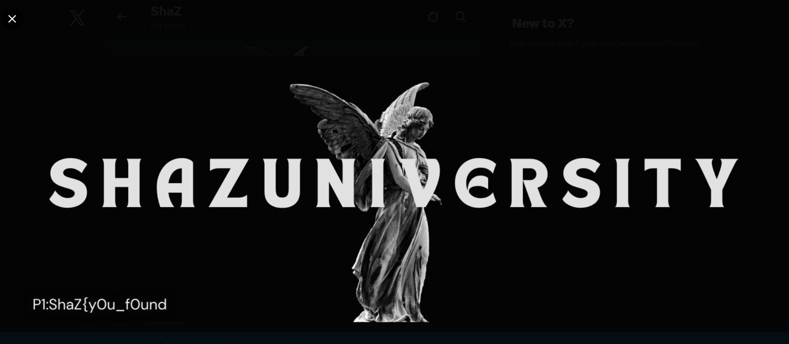
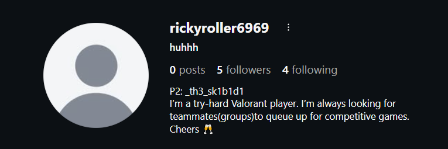
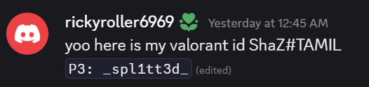
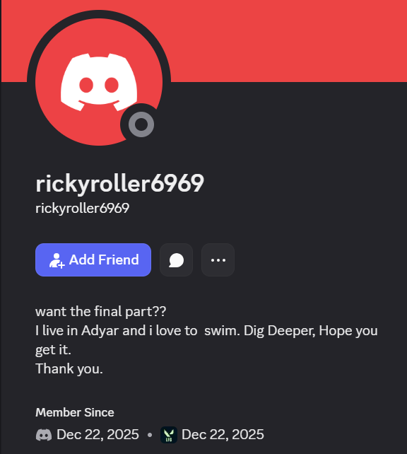
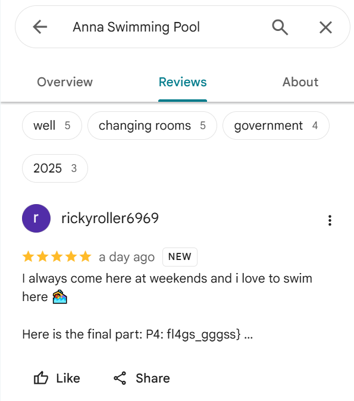

# Social Split (1000 points)

## Description:

A single username appears across multiple social platforms. Each account hides a fragment of the flag. Track them all, assemble the pieces, and submit the final flag. 
Username: `rickyroller6969`

## Solution:

The first part of the flag was in the header photo of the user's profile in Twitter.

The second part of the flag was in the Instagram bio of the user

From the instagram bio, I got a clue that the user is a Valorant player and is looking for groups. So I looked for this username in the players-lf-team-other channel of the Valorant LFG server of Discord and found this message in that channel

Going to the user's profile in Discord revealed that they live in Adyar and love to swim. 

So searching for the same in Google maps lead to the Anna Swimming Pool. The flag was found in the review section of the same.

Therefore the final assembled flag is:

`ShaZ{yOu_fOund_th3_sk1b1d1_spl1tt3d_fl4gs_gggss}